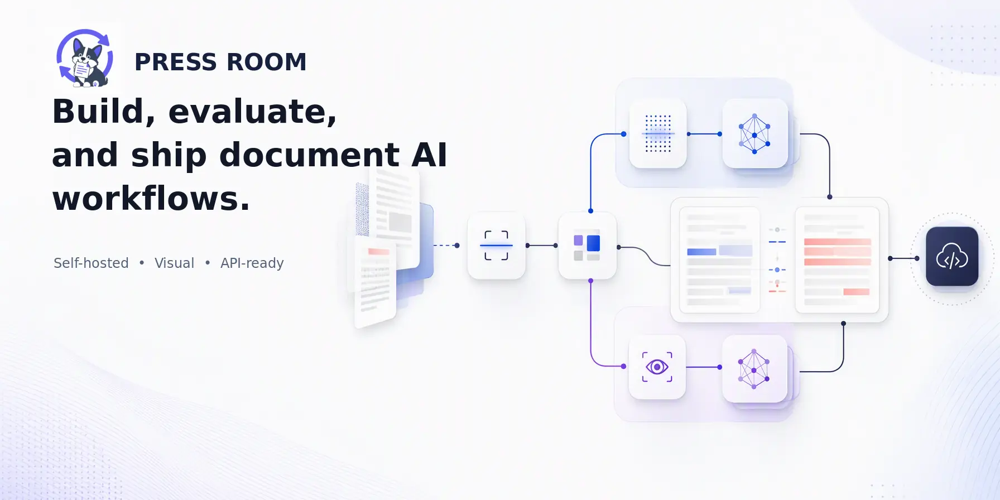

# PressRoom

<p align="center">
  <strong>English</strong> ·
  <a href="./README.zh-CN.md">简体中文</a>
</p>

<p align="center">
  <a href="#quick-start">Quick start</a> ·
  <a href="#build-evaluate-and-ship">Product tour</a> ·
  <a href="#deployment-and-distribution">Deployment</a> ·
  <a href="#public-workflow-api">Workflow API</a> ·
  <a href="https://jaminmei.github.io/Pressroom/">Documentation</a> ·
  <a href="SECURITY.md">Security</a> ·
  <a href="#support-pressroom">Star us</a>
</p>



PressRoom is the public source edition of **Document Conversion**, a self-hosted workspace for designing, running, evaluating, and publishing document-processing workflows. Connect OCR, layout detection, image preprocessing, document converters, and OpenAI-compatible vision models on a typed visual canvas—then compare outputs against versioned ground truth and expose a published workflow through a workflow-scoped HTTP API.

## Quick start

**Requirements:** Docker Engine with Docker Compose v2, plus at least 16 GB RAM for the standard or full profile. Model-heavy engines may require more.

1. Create the environment file:

   ```bash
   cp .env.example .env
   ```

2. Replace every required placeholder in `.env`. Generate a Provider encryption key with:

   ```bash
   python3 -c "from cryptography.fernet import Fernet; print(Fernet.generate_key().decode())"
   ```

3. Build and start the standard application:

   ```bash
   docker compose --profile standard up -d --build
   ```

4. Open [http://localhost:5173](http://localhost:5173), register an account, and create a workspace.

The standard profile starts the UI, API, PostgreSQL, and all built-in engines with serial workflow execution. Check backend liveness at [http://localhost:8000/api/health](http://localhost:8000/api/health).

For a first run without an external model, open **Template Center** and apply the built-in **PDF → OCR** template. To use Model nodes, add an OpenAI-compatible or Azure OpenAI Provider under **Settings → Model Providers**.

## Build, evaluate, and ship

### Build

Compose typed document workflows on a visual canvas. Connect file inputs, preprocessing and layout nodes, OCR and conversion engines, or workspace-scoped vision models; validate compatible ports, run the graph, and inspect node-level outputs without leaving the editor.


<p align="center"><em>Build — One PDF branches into RapidOCR and a workspace-scoped vision model on the same typed canvas.</em></p>

Start from the built-in OCR, Model, and multi-engine comparison templates, or import and adapt an existing workflow definition.

### Evaluate

Create a **Database** for a reusable document set, maintain append-only ground-truth versions, and run a saved workflow across the set. Review per-document status, compare expected and actual content side by side, and accept a reviewed output as a new ground-truth version.


<p align="center"><em>Evaluate — This synthetic run contains one pass, one difference, and one document without ground truth.</em></p>

### Ship

Publish a workflow version and make it available through a workflow-scoped HTTP API. Issue or revoke keys, copy upload and URL requests, inspect call volume and latency, and open a per-run trace without exposing Provider credentials.


<p align="center"><em>Ship — Monitor call volume, success rate, latency, storage, and per-run traces for a published workflow.</em></p>

All product screenshots above were captured from the standard profile with deterministic synthetic fixtures. They contain no production documents, user data, Provider endpoints, or reusable credentials.

## Highlights

- Visual, typed DAG workflows with reusable templates
- OCR, layout detection, image enhancement, image rotation, Text, MarkItDown, and Docling engines
- OpenAI-compatible and Azure OpenAI vision Providers configured per workspace
- Versioned ground truth, batch evaluation, result comparison, and review
- Serial execution or durable Redis/Celery queue execution
- English and Traditional Chinese UI
- Session authentication, workspace RBAC, encrypted Provider credentials, and guarded network inputs
- Published workflow APIs with URL and multipart-upload input modes

## Configure a vision Provider

Open **Settings → Model Providers** and create an `openai_compatible` Provider.

- For a standard OpenAI-compatible API, select **OpenAI compatible**, enter the API base URL, and optionally discover models from `/models`.
- For Azure OpenAI, select **Azure OpenAI**, enter the Azure endpoint and API version, then add deployment names manually.
- The Provider URL is always explicit; the application never substitutes a deployment-wide upstream URL.

If exactly one enabled model is available, new workflows select it automatically. With zero or multiple enabled models, the workflow asks the user to choose.

<details>
<summary><strong>Private-network Provider policy</strong></summary>

`PROVIDER_ALLOW_PRIVATE_HOSTS=true` permits workspace Providers on private or loopback networks, which is convenient for local engines. Link-local addresses, cloud metadata endpoints, reserved or multicast addresses, and DNS rebinding remain blocked.

In an untrusted multi-tenant deployment, set `PROVIDER_ALLOW_PRIVATE_HOSTS=false` unless private routing is an intentional part of the threat model.

</details>

## Deployment and distribution

Version 0.2.13 is distributed as source code only. The project does not publish prebuilt Docker/OCI images to GHCR, Docker Hub, or another container registry. The Compose commands build project images locally from the checked-in Dockerfiles.

| Profile | Services | Typical use |
| --- | --- | --- |
| `core` | Built-in engines | Engine development |
| `standard` | Core + backend + frontend + PostgreSQL | Single-process application execution |
| `full` | Standard + Redis + Celery worker | Durable queue execution |

The standard and full profiles include the hardened Adaptor sandbox runtime
boundary for `processor/adaptor` execution: backend and Celery worker send
Adaptor requests only to the canonical internal broker URL
`http://adaptor-sandbox-broker:8080` on the app network, while a separate
runner with `network_mode: none` communicates only over the named
Docker-managed UDS volume at `/run/adaptor-sandbox`. Phase 04 established and
verified that boundary, and Phase 05 wires backend and worker to the broker
without granting them any direct runner access. The runner uses container
hardening and per-request child processes for containment in depth, but it is
not presented as VM-grade isolation.

Adaptor execution admission is strict single-flight:
one in-flight adaptor request is allowed, and a second concurrent request is
rejected immediately with a safe `queue_full`/503 response rather than queued.
Cancellation is cooperative: queue and serial paths stop scheduling new DAG
nodes after cancellation is observed, but they do not forcibly interrupt an
Adaptor call that is already in flight.

To start the full profile, first set `ORCHESTRATOR_MODE=queue` and `ENABLE_QUEUE_MODE=true` in `.env`, then run:

```bash
docker compose --profile full up -d --build
```

All Compose profiles require the secrets documented in `.env.example`. Public deployments always run with `WORKSPACE_RBAC_ENFORCED=true`.

Locally built images contain third-party base images, Python and npm packages, and system components such as Poppler. Packages such as `certifi` retain their own terms. Review [Third-Party Notices](THIRD_PARTY_NOTICES.md), the lockfiles, and the license metadata shipped by those components before redistributing an image.

## Public workflow API

Publish a workflow from the UI, create a key in **API Access**, and invoke the versioned API under `/api/v1/workflows/{workflow_id}`. The UI provides ready-to-copy requests for both supported input modes:

- **URL input** for documents already reachable by the server, with SSRF-safe fetching and streaming byte limits.
- **Multipart upload** for local files, with rate limiting, size checks, and magic-byte validation.

Each key is scoped to one workflow. Never expose API keys in browser code or commit them to the repository. See [SECURITY.md](SECURITY.md) for reporting and deployment guidance.

## Local development

The local toolchain requires Node.js 20+ and Python 3.11.

Backend:

```bash
python3 -m venv .venv
source .venv/bin/activate
python3 -m pip install --require-hashes -r requirements-dev.lock
# Required by the repository-wide suite, including the separately licensed Text engine tests.
python3 -m pip install --require-hashes -r tests/requirements-text-engine.lock
alembic upgrade head
uvicorn app.main:app --reload
```

Frontend:

```bash
cd frontend
npm ci
npm run dev
```

Documentation site (Node.js 22):

```bash
cd website
npm ci
npm run docs:dev
```

Quality gates:

```bash
ruff check .
ruff format --check .
mypy app
pytest -q

cd frontend
npm run lint
npm run typecheck
npm run test -- --run
npm run build
```

Run `python3 scripts/check-public-boundary.py --include-untracked` before committing public-release changes.

<details>
<summary><strong>One-time 0.2.0 publication history gate</strong></summary>

For the one-time 0.2.0 root publication, run the stricter history gate after creating the root commit and again after creating the release tag:

```bash
python3 scripts/check-public-boundary.py --initial-release-tag v0.2.0
```

This release-only mode accepts zero tags or exactly `v0.2.0` and requires all refs to resolve to the single parentless release commit. It is intentionally not part of normal post-release CI, where public history grows linearly.

</details>

## Documentation

- [Contributing](CONTRIBUTING.md)
- [Security policy](SECURITY.md)
- [Model sources and license records](docs/model-licenses.md)
- [Project-authored assets](ASSETS.md)
- [Third-party notices](THIRD_PARTY_NOTICES.md)
- [Trademark policy](TRADEMARKS.md)

## License

This is a mixed-license repository:

- Unless a file or directory says otherwise, original Document Conversion code and assets are licensed under the [MIT License](LICENSE), copyright 2026 Jamin Mei and ricoyudog.
- Every original work under [`engines/text/**`](engines/text/) is licensed under **GPL-3.0-only**. Its complete license is available in [`engines/text/COPYING`](engines/text/COPYING) and [`LICENSES/GPL-3.0-only.txt`](LICENSES/GPL-3.0-only.txt).

The Text engine runs as a separate HTTP service; other components must use its engine API rather than import its GPL-covered modules. Third-party dependencies and runtime model artifacts remain under their respective terms. The MIT copyright license does not grant rights in project trademarks; see [TRADEMARKS.md](TRADEMARKS.md).

## Support PressRoom

If PressRoom helps your document workflow, please consider [giving the project a Star](https://github.com/jaminmei/Pressroom). It helps more people discover the project—and gives the Corgi extra energy to keep shipping.

<p align="center">
  <a href="https://github.com/jaminmei/Pressroom">
    
  </a>
</p>

<p align="center"><strong>⭐ Thank you for supporting PressRoom.</strong></p>
