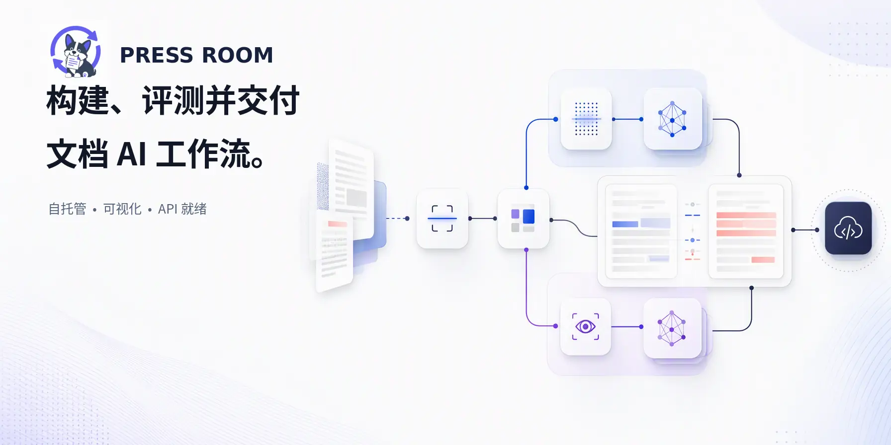
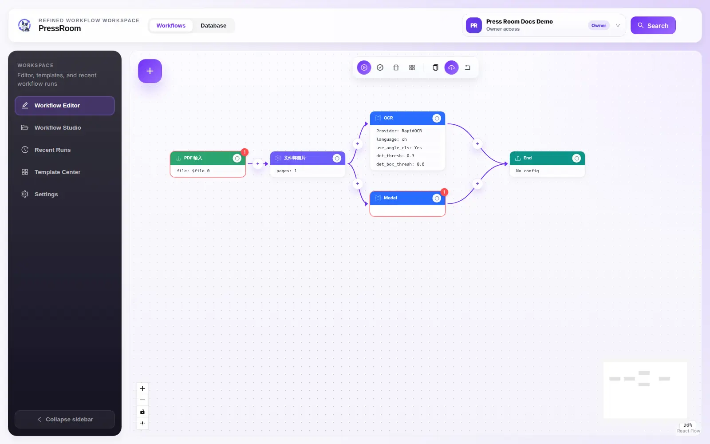
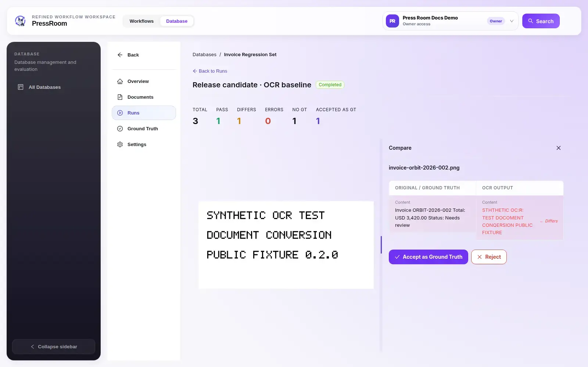
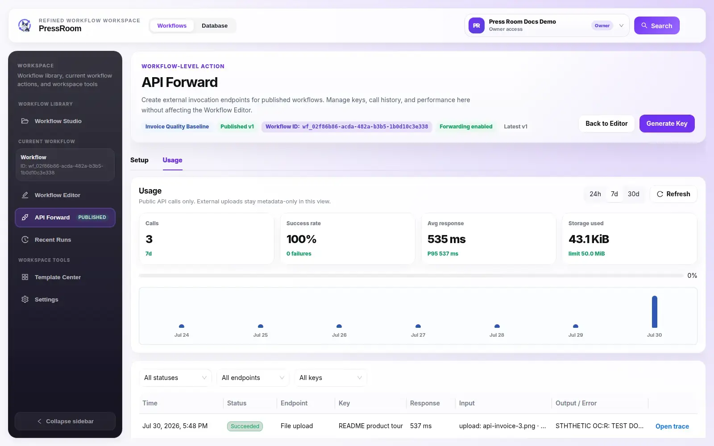

# PressRoom

<p align="center">
  <a href="./README.md">English</a> ·
  <strong>简体中文</strong>
</p>

<p align="center">
  <a href="#快速开始">快速开始</a> ·
  <a href="#构建评测并交付">产品导览</a> ·
  <a href="#部署与分发">部署</a> ·
  <a href="#公开工作流-api">工作流 API</a> ·
  <a href="https://jaminmei.github.io/Pressroom/zh-CN/">文档站</a> ·
  <a href="SECURITY.md">安全</a> ·
  <a href="#支持-pressroom">给个 Star</a>
</p>



PressRoom 是 **Document Conversion** 的公开源代码版。这是一套自托管工作空间，用于设计、运行、评测和发布文档处理工作流。你可以在带类型约束的可视化画布上连接 OCR、版面检测、图像预处理、文档转换引擎和 OpenAI 兼容视觉模型；随后将输出与版本化 Ground Truth 对比，并通过工作流级 HTTP API 对外提供已发布的工作流。

## 快速开始

**环境要求：** Docker Engine 和 Docker Compose v2。`standard` 或 `full` Profile 至少需要 16 GB 内存；使用模型较重的引擎时可能需要更多。

1. 创建环境变量文件：

   ```bash
   cp .env.example .env
   ```

2. 替换 `.env` 中所有必填占位符。使用下面的命令生成 Provider 加密密钥：

   ```bash
   python3 -c "from cryptography.fernet import Fernet; print(Fernet.generate_key().decode())"
   ```

3. 构建并启动标准部署：

   ```bash
   docker compose --profile standard up -d --build
   ```

4. 打开 [http://localhost:5173](http://localhost:5173)，注册账号并创建工作空间。

标准部署会启动 UI、API、PostgreSQL 和全部内置引擎，并使用串行工作流执行模式。可以通过 [http://localhost:8000/api/health](http://localhost:8000/api/health) 检查后端存活状态。

第一次运行无需配置外部模型：打开 **Template Center**，应用内置的 **PDF → OCR** 模板即可。如果要使用 Model 节点，请前往 **Settings → Model Providers** 添加 OpenAI 兼容或 Azure OpenAI Provider。

## 构建、评测并交付

### 构建

在可视化画布上组合带类型约束的文档工作流。连接文件输入、预处理和版面节点、OCR 与文档转换引擎，或工作空间级视觉模型；验证端口兼容性、运行工作流，并直接查看每个节点的输出。



<p align="center"><em>构建——同一份 PDF 在一个带类型约束的画布上，同时进入 RapidOCR 和工作空间视觉模型。</em></p>

你可以从内置 OCR、Model 或多引擎对比模板开始，也可以导入并调整已有工作流定义。

### 评测

创建 **Database（数据库）** 来管理可复用文档集，维护只追加不覆盖的 Ground Truth 版本，并对整个文档集运行已保存的工作流。逐份检查运行状态，并排比较预期结果与实际结果，还可以将审核通过的输出保存为新的 Ground Truth 版本。



<p align="center"><em>评测——这个合成示例包含一份通过、一份存在差异，以及一份尚无 Ground Truth 的文档。</em></p>

### 交付

发布工作流版本，并通过工作流级 HTTP API 提供服务。你可以创建或撤销密钥、复制文件上传和 URL 调用示例、查看调用量与延迟，并打开单次运行的节点级 Trace；整个过程不会暴露 Provider 凭据。



<p align="center"><em>交付——监控已发布工作流的调用量、成功率、延迟、存储用量和单次运行 Trace。</em></p>

以上产品截图均从标准部署中使用确定性合成测试数据拍摄，不包含生产文档、真实用户数据、Provider 地址或可复用凭据。

## 核心能力

- 带类型约束的可视化 DAG 工作流与可复用模板
- OCR、版面检测、图像增强、图像旋转、Text、MarkItDown 和 Docling 引擎
- 按工作空间配置的 OpenAI 兼容及 Azure OpenAI 视觉 Provider
- 版本化 Ground Truth、批量评测、结果对比和人工审核
- 串行执行，或基于 Redis/Celery 的持久化队列执行
- 英文与繁体中文 UI
- 会话认证、工作空间 RBAC、Provider 凭据加密和受保护的网络输入
- 同时支持 URL 与 multipart 文件上传的工作流 API

## 配置视觉 Provider

打开 **Settings → Model Providers**，创建一个 `openai_compatible` Provider。

- 使用标准 OpenAI 兼容 API 时，选择 **OpenAI compatible**，填写 API Base URL，并可选择从 `/models` 自动发现模型。
- 使用 Azure OpenAI 时，选择 **Azure OpenAI**，填写 Azure Endpoint 和 API Version，然后手动添加 Deployment 名称。
- Provider URL 始终需要明确配置；应用不会使用部署级上游 URL 代替它。

如果恰好只有一个已启用模型，新工作流会自动选择它；当已启用模型为零个或多个时，工作流会要求用户选择。

<details>
<summary><strong>私有网络 Provider 策略</strong></summary>

`PROVIDER_ALLOW_PRIVATE_HOSTS=true` 允许工作空间 Provider 访问私有网络或回环地址，适合连接本地引擎。即使启用该选项，链路本地地址、云元数据端点、保留地址、多播地址和 DNS 重绑定仍会被阻止。

在不受信任的多租户部署中，除非私有网络路由是明确的威胁模型组成部分，否则应设置 `PROVIDER_ALLOW_PRIVATE_HOSTS=false`。

</details>

## 部署与分发

0.2.13 版本仅以源代码形式分发。项目不会向 GHCR、Docker Hub 或其他容器仓库发布预构建 Docker/OCI 镜像。Compose 命令会使用仓库中的 Dockerfile 在本地构建项目镜像。

| Profile | 服务 | 典型用途 |
| --- | --- | --- |
| `core` | 内置引擎 | 引擎开发 |
| `standard` | Core + backend + frontend + PostgreSQL | 单进程应用执行 |
| `full` | Standard + Redis + Celery worker | 持久化队列执行 |

启动完整部署前，先在 `.env` 中设置 `ORCHESTRATOR_MODE=queue` 和 `ENABLE_QUEUE_MODE=true`，然后运行：

```bash
docker compose --profile full up -d --build
```

所有 Compose 配置都需要 `.env.example` 中记录的敏感配置。公开部署始终使用 `WORKSPACE_RBAC_ENFORCED=true`。

本地构建的镜像包含第三方基础镜像、Python 与 npm 包，以及 Poppler 等系统组件；`certifi` 等包也保留各自的条款。重新分发镜像前，请查看 [Third-Party Notices](THIRD_PARTY_NOTICES.md)、锁文件和这些组件附带的许可证元数据。

## 公开工作流 API

在 UI 中发布工作流，在 **API Access** 中创建密钥，然后调用 `/api/v1/workflows/{workflow_id}` 下的版本化 API。UI 会为两种输入模式提供可直接复制的调用示例：

- **URL 输入**：适合服务端已经可以访问的文档，带 SSRF 防护的远程抓取及流式字节上限。
- **Multipart 文件上传**：适合本地文件，带有限流、大小检查和文件魔数校验。

每个密钥只绑定一个工作流。不要在浏览器代码中暴露 API Key，也不要将其提交到仓库。安全问题报告和部署建议请参阅 [SECURITY.md](SECURITY.md)。

## 本地开发

本地工具链需要 Node.js 20+ 和 Python 3.11。

后端：

```bash
python3 -m venv .venv
source .venv/bin/activate
python3 -m pip install --require-hashes -r requirements-dev.lock
# 仓库完整测试套件（包含单独授权的 Text 引擎测试）需要此依赖。
python3 -m pip install --require-hashes -r tests/requirements-text-engine.lock
alembic upgrade head
uvicorn app.main:app --reload
```

前端：

```bash
cd frontend
npm ci
npm run dev
```

文档站（Node.js 22）：

```bash
cd website
npm ci
npm run docs:dev
```

质量检查：

```bash
ruff check .
ruff format --check .
mypy app
pytest -q

cd frontend
npm run lint
npm run typecheck
npm run test -- --run
npm run build
```

提交公共发布改动前，请运行 `python3 scripts/check-public-boundary.py --include-untracked`。

<details>
<summary><strong>0.2.0 一次性发布历史检查</strong></summary>

首次发布 0.2.0 根提交时，请在创建根提交后以及创建发布标签（Release Tag）后分别运行更严格的历史检查：

```bash
python3 scripts/check-public-boundary.py --initial-release-tag v0.2.0
```

该发布专用模式只接受零个标签或唯一的 `v0.2.0`，并要求所有引用（Ref）都指向同一个无父提交的发布提交。正常发布后的公开历史会线性增长，因此日常 CI 不使用该模式。

</details>

## 文档

- [贡献指南](CONTRIBUTING.md)
- [安全策略](SECURITY.md)
- [模型来源与许可证记录](docs/model-licenses.md)
- [项目原创资产](ASSETS.md)
- [第三方声明](THIRD_PARTY_NOTICES.md)
- [商标策略](TRADEMARKS.md)

## 许可证

本仓库采用混合许可证：

- 除非文件或目录另有说明，Document Conversion 的原创代码和资产均使用 [MIT License](LICENSE)，版权所有 © 2026 Jamin Mei 与 ricoyudog。
- [`engines/text/**`](engines/text/) 下的所有原创作品使用 **GPL-3.0-only**。完整许可证位于 [`engines/text/COPYING`](engines/text/COPYING) 和 [`LICENSES/GPL-3.0-only.txt`](LICENSES/GPL-3.0-only.txt)。

Text 引擎作为独立 HTTP 服务运行；其他组件必须通过它的 Engine API 使用该服务，不得直接导入 GPL 覆盖的模块。第三方依赖和运行时模型资产继续遵循各自条款。MIT 版权许可不授予项目商标权，详情请参阅 [TRADEMARKS.md](TRADEMARKS.md)。如中文说明与许可证原文存在差异，以许可证原文为准。

## 支持 PressRoom

如果 PressRoom 对你的文档工作流有帮助，欢迎[给项目一个 Star](https://github.com/jaminmei/Pressroom)。你的支持能帮助更多人发现这个项目，也会让柯基更有动力继续迭代。

<p align="center">
  <a href="https://github.com/jaminmei/Pressroom">
    
  </a>
</p>

<p align="center"><strong>⭐ 感谢你支持 PressRoom。</strong></p>
